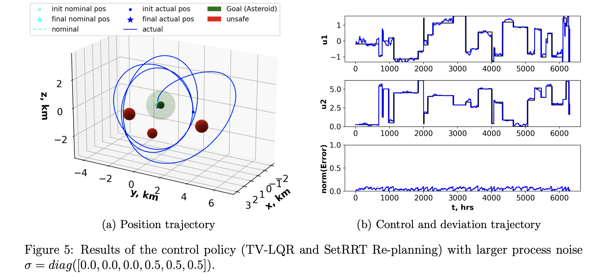

# Docker
The project is dockerized.

## build dockerfile
```console
docker build -t jordan787878/solarsail:tag .
```

## run dockerfile to init develop environment
```console
docker run -it --name solarsail-dev --rm -v $(pwd):/develop jordan787878/solarsail:tag
```

## build after coding
```console
cd develop
./build_and_compile.sh
./build/bin/test_<project.cpp>
```

## push dockerfile
```
docker push jordan787878/solarsail:tag
```

# Documentation

You can view the full documentation in the [PDF file](./Navigation_Project_Solarsail.pdf).



