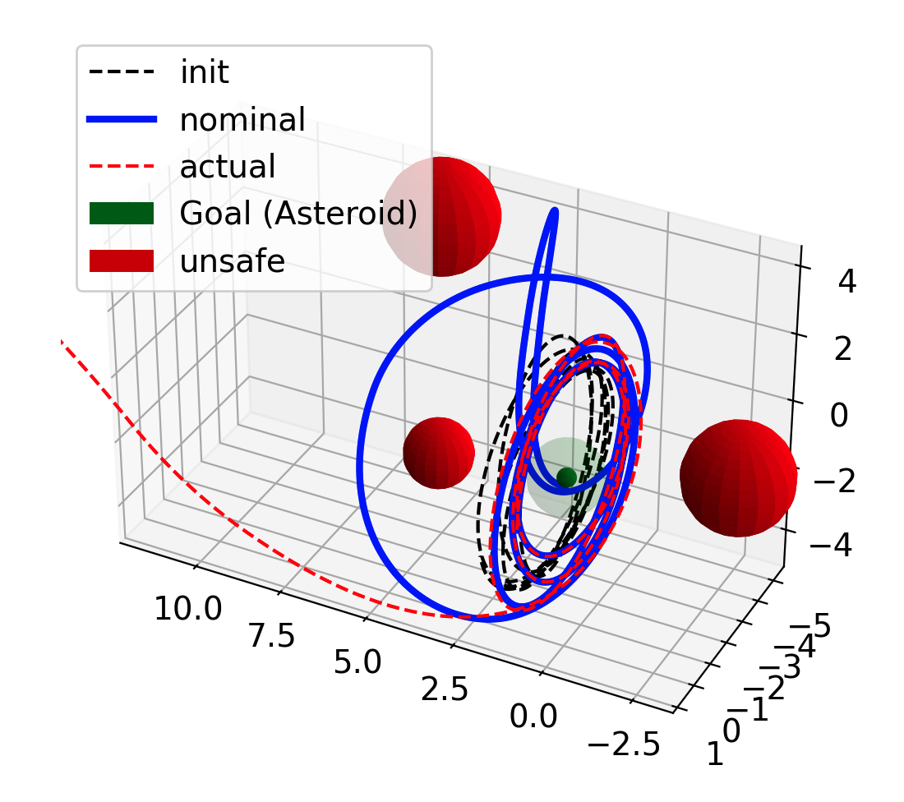

# Solar Sail Navigation

## SetRRT Solution Visualization
The spacecraft is initially at a periodic orbit (black dash). SetRRT finds the state and control trajectory from the initial orbit to an asteroid (green ball). During planning, it does not consider any uncertainty. 

Four different initial orbits and environments are included. The blue line is the nominal controlled trajectory. The red dash line is the controlled trajectory with process noise. The first row has no unsafe space. The second row has multiple unsafe space.

1. unconstrained state space
<table>
  <tr>
    <td></td>
    <td></td>
    <td></td>
    <td></td>
  </tr>
</table>

2. state space with circular unsafe regions
<table>
  <tr>
   <td></td>
    <td></td>
    <td></td>
    <td></td>
  </tr>
</table>

3. 10 Unsafe Regions: State and Control Trajectory
<table>
  <tr>
   <td></td>
    <td></td>
  </tr>
</table>

4. Animation

https://github.com/jordan787878/solar-sail/assets/17584164/d9b81a1a-f746-4272-95a6-6b58f85204bf


# Generalize to other Problem
The framework can be applied to other problems, provided their ODEs.
## Marine Vessel Navigation
A marine vessel controlled by forward velocity (u1) and yaw rate (u3). The mission is to reach the green goal and avoid the red unsafe regions.
<table>
  <tr>
   <td></td>
    <td></td>
  </tr>
</table>

Animation

https://github.com/jordan787878/solar-sail/assets/17584164/b0716dbc-bea3-4bb8-bcaa-bb576a97cb03

## Cart and Inverted Pendulum
An inverted pendulum is attached to a cart. The cart is controlled by a horizontal force u. The system has four states: angle and angular rate of the inverted pendulum; position and velocity of the cart. The goal is to: 
1. swing up the inverted pendulum such that it is at the upright position. 
2. the position and the velocity of the cart should also reach a certain region.
<table>
  <tr>
   <td></td>
    <td></td>
  </tr>
</table>

Animation
<table>
  <tr>
   <td>cart x = 0</td>
   <td>cart x = 1</td>
  </tr>
</table>

# Optimization
We can further optimize the controlled trajectory using the Set-RRT-AO planner. The -AO stands for asymptotically optimal. 

## Minimize Total Time of Control
The cost measure is the total time of the controlled trajectory. We can obtain a faster solution to reach the goals. Below we show the examples of: solar sail, marine vessel, and cart inverted pendulum.

1. Solar Sail
<table>
  <tr>
   <td>time: big</td>
   <td>time: small</td>
  </tr>
</table>

2. Marine Vessel
<table>
  <tr>
   <td>time: big</td>
   <td>time: small</td>
  </tr>
</table>

3. Cart Inverted Pendulum
<table>
  <tr>
   <td>time: big</td>
   <td>time: small</td>
  </tr>
</table>

# Run-Time Control with Uncertainty
Consider now the system is influenced by process noise. We employ a LQR control to update the control signals of the motion planner in run-time:
$u_{\text{online}} = u_{\text{planner}} + \delta u_{\text{LQR}}$, where $\delta u_{\text{LQR}} = -K \delta x$.
The gain $K$ is computed by solving the dicrete-time algebraic Riccati equations. 

First, we show the animation of the (blue) ideal trajectory generated by the motion planner (without process noise), and (red) run-time trajectory using motion planner + LQR update to address process noise. 

Secondly, if we do not update the control signal online, then the inverted pendulum will not be able to reach the goal and stabilize under uncertainties. This is shown by the second animation where (purple) is the run-time trajectory by the motion planner with process noise, and (red) is the same trajectory shown in the first animation.

https://github.com/jordan787878/solar-sail/assets/17584164/4ef42973-1c40-4a87-bd56-364b357aec9e

https://github.com/jordan787878/solar-sail/assets/17584164/d578e824-b3c6-45b1-afa1-5dcd53e10f0d


# C++

## build the project
```
cd root folder
cmake -B build .
cmake --build build
./build/bin/test_main
```

# Docker

## build dockerfile
```console
docker build -t jordan787878/solarsail:tag .
```

## run dockerfile to init develop environment
```console
docker run -it --name solarsail-dev --rm -v $(pwd):/develop jordan787878/solarsail:tag
```

## build after coding
```console
cd build
cmake ..
make
```

## push dockerfile
```
docker push jordan787878/solarsail:tag
```
